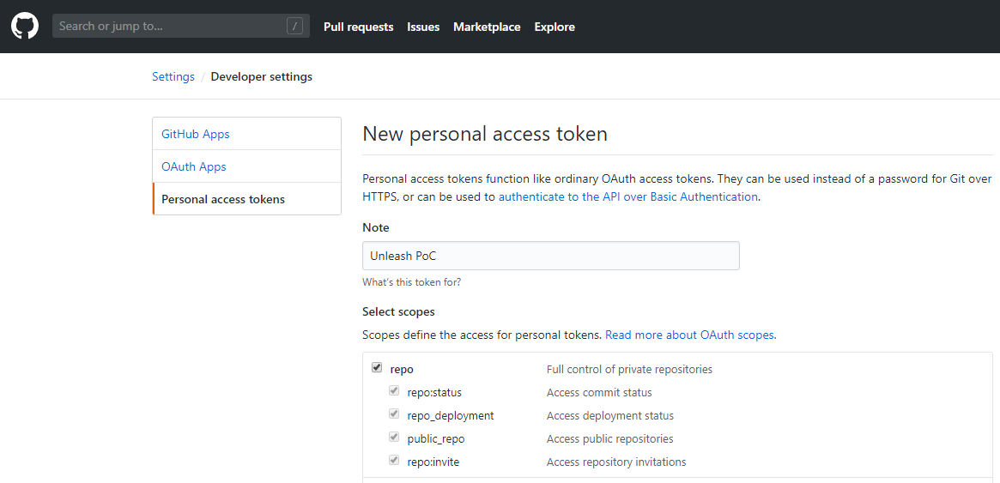

# Unleash PoC

A project to explore the capabilities of the Maven Unleash Plugin.

## Getting Started

In GitHub, navigate to Settings -> Developer settings -> Personal access tokens and click the Generate new token button. Grant at least the following privileges.

```
repo:status
repo_deployment
repo_public
```



### Prerequisites

Maven

### Installing

Invoke the plugin and "unleash" the revision.

```bash
mvn unleash:perform -Dunleash.scmPassword=xxx
```

## Built With

- Java
- Maven
- GitHub

## Acknowledgments

[Stanley Hillner](https://github.com/shillner) (shillner) and the [unleash-maven-plugin](https://github.com/shillner/unleash-maven-plugin)
